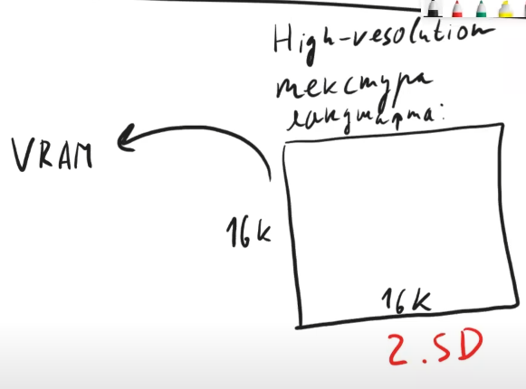
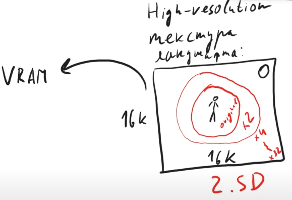

	

# Nanite

#####  Nikolai Poliarnyi :
###### *Как работает Nanite в Unreal Engine 5*
- - -

Постановка задачи / мечта

|  | Кино | Игры|
|:------|:------:|:------:|
| Отрисовка | Offline | Realtime ${1\over 60}$ |
| Скорость обработки | Высокое качество | Бюджет качества |
| Подготовка ассетов | **Оригинал** | **Упрощаем assets** |

> Боль игр: Упрощение assets
>> * Время людей
>> * Специфика задачи
>> * Деньги

> Боль кино: Отрисовка
>> * Не хочется долго ждать результата

##### Хотим отдать задачу «упрощение assets» движку Unreal Engine, чтобы удовлетворить все запросы

 

[//]: # (--- Следующая вкладка ---)

Виртуальные текстуры: почему задача решаема

#### Id Tech
###### Компания, разработавшая популярные игры, засчет технологического прорыва:
> Doom, Quake, <ins>Rage</ins>

###### Они и придумали виртуальные текстуры (ранее назывались Mega Texture, прижилось Virtual Texture)

 

##### Пример: 
###### Есть тяжелая по тем меркам текстура ландшафта 16к х 16к
> * ! Не влезает в память видеокарты (VRAM)
> * ! Нужно перерисовывать большой обьем информации

Highmap resolution №1

 

###### * Если объект находится далеко, он может быть не виден персонажу или являться одним пикселем
###### Напрашивается разделить ландшафт на окрестности
> * Рядом с персонажем оригинальное качество
> * По удалению от него уменьшать разрешение
#### *Версия текстуры у которой есть разные уровни детализации называется <ins>MipMap</ins>* 

Highmap resolution №2

 

###### Это все еще не решает проблему с объемом видеопамяти (VRAM)
> ! Теперь необходимо иметь несколько сжатых версий одной и той же текстуры

 

[//]: # (--- Следующая вкладка ---)

- - -

## License

MIT

[//]: # (Created on 23/12/2023)
[//]: # (By furokl)