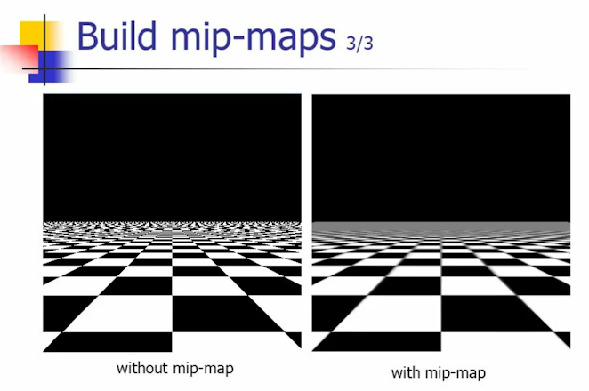
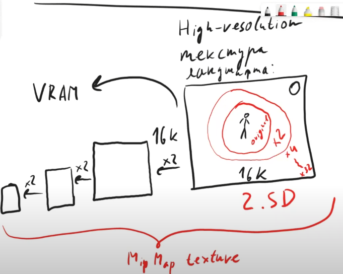
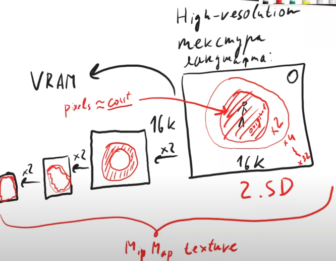
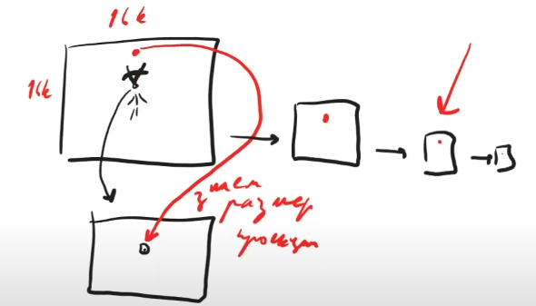

	

# Nanite

#####  Nikolai Poliarnyi :
###### *Как работает Nanite в Unreal Engine 5*
- - -

Постановка задачи / мечта

|  | Кино | Игры|
|:------|:------:|:------:|
| Отрисовка | Offline | Realtime ${1\over 60}$ |
| Скорость обработки | Высокое качество | Бюджет качества |
| Подготовка ассетов | **Оригинал** | **Упрощаем assets** |

> Боль игр: Упрощение assets
>> * Время людей
>> * Специфика задачи
>> * Деньги

> Боль кино: Отрисовка
>> * Не хочется долго ждать результата

##### Хотим отдать задачу «упрощение assets» движку Unreal Engine, чтобы удовлетворить все запросы

[//]: # (--- Конец вкладки: Постановка задачи ---)

 

Виртуальные текстуры: почему задача решаема

#### Id Tech
###### Компания, разработавшая популярные игры, засчет технологического прорыва:
> Doom, Quake, <ins>Rage</ins>

###### Они и придумали виртуальные текстуры (ранее назывались Mega Texture, прижилось Virtual Texture)

 

Mip Map: 

###### Есть тяжелая по тем меркам текстура ландшафта 16к х 16к
> * ! Не влезает в память видеокарты (VRAM)
> * ! Нужно перерисовывать большой обьем информации

Highmap resolution №1

[//]: # (--- Конец вкладки: Highmap resolution №1 ---)

 

###### * Если объект находится далеко, он может быть не виден персонажу или являться одним пикселем
###### Напрашивается разделить ландшафт на окрестности
> * Рядом с персонажем оригинальное качество
> * По удалению от него уменьшать разрешение
###### *<ins>Mip Map</ins> - Версия текстуры у которой есть разные уровни детализации* 

Highmap resolution №2

[//]: # (--- Конец вкладки: Highmap resolution №2 ---)

 

###### Это все еще не решает проблему с объемом видеопамяти (VRAM)
> ! Теперь необходимо иметь несколько сжатых версий одной и той же текстуры

Highmap resolution №3

[//]: # (--- Конец вкладки: Highmap resolution №3 ---)

 

###### Тогда мы будем хранить в видеопамяти только разбитые окрестности.
> * В конечном итоге должно выйти, что объем видеопамяти равен кол-ву пикселей монитора
> * Перестаем зависить от разрешения текстуры
###### НО
> * ! Мы предполагаем, что можем автоматически определить какие части текстуры нужны
> * ! Мы предполагаем, что кто-то сам положит в видеопамять эти окрестности

Highmap resolution №4

[//]: # (--- Конец вкладки: Highmap resolution №4 ---)

 

[//]: # (--- Конец вкладки: Mip Map ---)

Рендер

###### Первый проход
###### Мы смотрим на объект и проецируем его на экран
###### Чтобы скомпенсировать: чем дальше объект от игрока, тем меньше у этого объекта уровень детальности, чтобы пиксель стал сопоставим с пикселем на экране
> * Знаем размер проекции
> * Знаем уровень Mip Map

Render №1

[//]: # (--- Конец вкладки: Render №1 ---)

[//]: # (--- Конец вкладки: Рендер ---)

[//]: # (--- Конец вкладки: Виртуальные текстуры: почему задача решаема ---)

- - -

## License

MIT

[//]: # (Created on 23/12/2023)
[//]: # (By furokl)